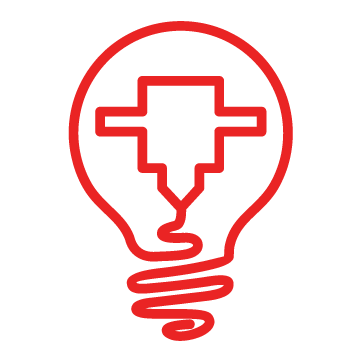

<a name="readme-top"></a>


[![Contributors][contributors-shield]][contributors-url]
[![Forks][forks-shield]][forks-url]
[![Stargazers][stars-shield]][stars-url]
[![Issues][issues-shield]][issues-url]
[![MIT License][license-shield]][license-url]
[![LinkedIn][linkedin-shield]][linkedin-url]


<!-- PROJECT LOGO -->
<br />
<div align="center">
  <a href="https://github.com/othneildrew/Best-README-Template">
    
  </a>

  <h3 align="center">Basic Node.js Project Starter Template</h3>

  <p align="center">
    A simple template for node js  projects with jest testing example with ESlint and prettier.
    <br />
    
  </p>
</div>


<!-- TABLE OF CONTENTS -->
<details>
  <summary>Table of Contents</summary>
  <ol>
    <li>
      <a href="#about-the-project">About The Project</a>
      <ul>
        <li><a href="#built-with">Built With</a></li>
      </ul>
    </li>
    <li>
      <a href="#getting-started">Getting Started</a>
      <ul>
        <li><a href="#prerequisites">Prerequisites</a>
         </li>
        <li><a href="#installation">Installation</a></li>
        <li><a href="#usage">Usage</a></li>
      </ul>
    </li>
  
  </ol>
</details>


<!-- ABOUT THE PROJECT -->
## About The Project

[![Product Name Screen Shot][product-screenshot]](https://example.com)

This is my first ever public project.just thought to release a node.js starter template for newbies.


<p align="right">(<a href="#readme-top">back to top</a>)</p>


### Built With

The template is integrated with

* [![Node][Node.js]][NODEjs-url]
* [![JEST][jestjs.io/]][Jest-url]


<p align="right">(<a href="#readme-top">back to top</a>)</p>


<!-- GETTING STARTED -->
## Getting Started

You will be needing node js and node package manager installed in your system.

### Prerequisites

after the basic installation of node start here
* npm
  ```sh
  npm install npm@latest -g
  ```
* nvm
  ```sh
  nvm use 18.18.2
  ```  

### Installation

_Below is the instruction of getting started with the template_


install the packages 
   ```sh
   npm install
   ```


### Usage

_Below is the instruction of how to use the template_   
1. Start the sample server 
   ```sh
   npm start
   ```
2. Run test with jest by 
    ```sh
   npm test
   ```

<p align="right">(<a href="#readme-top">back to top</a>)</p>


<!-- LICENSE -->
## License


You are free to use this content and code for personal education purposes. However, you are not authorized to publish this content or code elsewhere, wthether for commercial purposes or not

<p align="right">(<a href="#readme-top">back to top</a>)</p>


<!-- CONTACT -->
## Contact

Faruk hannan -  - idea3d.faruk@gmail.com

<p align="right">(<a href="#readme-top">back to top</a>)</p>


<p align="right">(<a href="#readme-top">back to top</a>)</p>


[Nodejs-url]: https://img.shields.io/badge/next.js-000000?style=for-the-badge&logo=nextdotjs&logoColor=white

[Jest-url]: https://img.shields.io/badge/React-20232A?style=for-the-badge&logo=react&logoColor=61DAFB


.